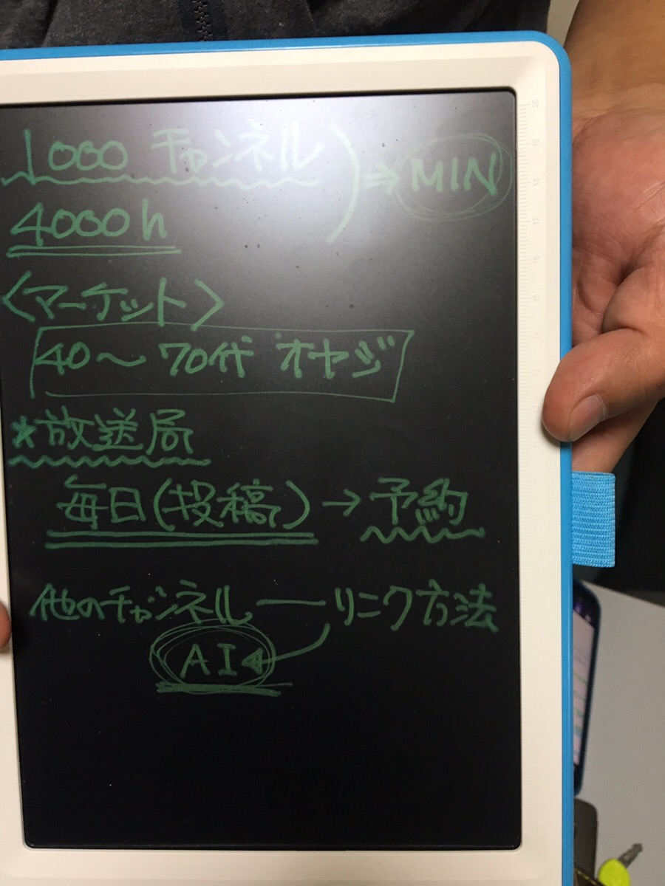

# YouTube

作成日時: 2019年11月6日 22:01
更新されました: 2019年11月17日 12:53

音源

マイケル

ニュースjapan

DHC

キャッチコピー

韓国 経済で検索してパクる

再生回数多いのを見本

まずは50回目標

今月中に100超えるといい

20チャンネルとろくでいい感じ

日本政治経済ニュース見本

エコノミックじんじん

政治、経済、ニュース系のチャンネル名